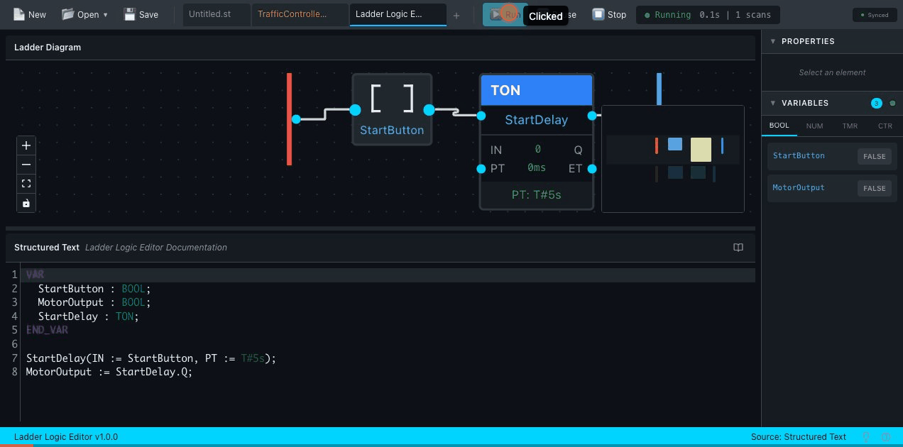

<p align="center">
  
  
  
  
</p>

<br/>

<h1 align="center">
  <code>━━┫ LADDER LOGIC EDITOR ┣━━</code>
</h1>

<p align="center">
  <strong>Transform Structured Text into visual ladder diagrams.</strong><br/>
  <strong>Simulate PLC logic in real-time. All in your browser.</strong>
</p>

<p align="center">
  <a href="https://cdilga.github.io/ladder-logic-editor/"><b>⚡ Live Demo</b></a>
  &nbsp;•&nbsp;
  <a href="#-quick-start">Quick Start</a>
  &nbsp;•&nbsp;
  <a href="#-features">Features</a>
  &nbsp;•&nbsp;
  <a href="#-architecture">Architecture</a>
</p>

<br/>

<p align="center">
  
</p>

<p align="center">
  <a href="https://cdilga.github.io/ladder-logic-editor/">
    
  </a>
</p>

<br/>

---

<br/>

## ⚡ What is this?

Write **IEC 61131-3 Structured Text** code. Watch it transform into **ladder diagrams** instantly. Run **live simulations** with scan cycle execution. Toggle inputs. Watch outputs change. Debug visually.

```
┌─────────────────────────────────────────────────────────────────────────────┐
│                                                                             │
│    ST Code                  Ladder Diagram              Variable Watch      │
│    ┌──────────┐            ┌──────────────┐            ┌──────────────┐    │
│    │ IF A AND │    ──►     │ ─┤A├─┤B├─(Y) │    ──►     │ A: [TRUE ]   │    │
│    │ B THEN   │            │              │            │ B: [FALSE]   │    │
│    │ Y := 1;  │            │ Power flows  │            │ Y: [FALSE]   │    │
│    └──────────┘            └──────────────┘            └──────────────┘    │
│                                                                             │
│    Write code               See it visualized          Simulate & debug     │
│                                                                             │
└─────────────────────────────────────────────────────────────────────────────┘
```

<br/>

## 🎯 Features

<table>
<tr>
<td width="50%">

### 🔄 Real-Time Transformation
Write ST code and watch the ladder diagram update instantly. Full bidirectional sync keeps everything in harmony.

### ⏱️ Timer Function Blocks
**TON** (On-Delay), **TOF** (Off-Delay), **TP** (Pulse) — all IEC 61131-3 compliant with proper timing behavior.

### 🔢 Counter Function Blocks
**CTU** (Count Up), **CTD** (Count Down), **CTUD** (Up/Down) — complete with preset values and output flags.

</td>
<td width="50%">

### 📈 Edge Detection
**R_TRIG** (Rising Edge), **F_TRIG** (Falling Edge) — single-scan pulse generation for event-driven logic.

### ▶️ Live Simulation
Run your ladder logic with real scan cycle execution. Toggle inputs, watch outputs respond, observe timer elapsed times.

### 👁️ Variable Watch Panel
Monitor all variables in real-time. Click to toggle BOOLs. View timers and counters. Filter by type.

</td>
</tr>
</table>

<br/>

### Full IEC 61131-3 ST Support

```
┌────────────────────┬──────────────────────────────────────────────────────┐
│ Category           │ Supported Elements                                   │
├────────────────────┼──────────────────────────────────────────────────────┤
│ Boolean Logic      │ AND, OR, XOR, NOT                                    │
│ Comparisons        │ =, <>, >, >=, <, <=                                  │
│ Arithmetic         │ +, -, *, /, MOD                                      │
│ Control Flow       │ IF/THEN/ELSIF/ELSE, CASE, FOR, WHILE, REPEAT        │
│ Timers             │ TON, TOF, TP                                         │
│ Counters           │ CTU, CTD, CTUD                                       │
│ Edge Detectors     │ R_TRIG, F_TRIG                                       │
│ Data Types         │ BOOL, INT, REAL, TIME                                │
│ Variable Sections  │ VAR, VAR_INPUT, VAR_OUTPUT, VAR_IN_OUT              │
└────────────────────┴──────────────────────────────────────────────────────┘
```

<br/>

## 🚀 Quick Start

```bash
# Clone the repository
git clone https://github.com/cdilga/ladder-logic-editor.git
cd ladder-logic-editor

# Install dependencies
npm install

# Start development server
npm run dev
```

Open **http://localhost:5173** and start writing ST code!

<br/>

## 📦 Example: Traffic Light Controller

```iecst
PROGRAM TrafficController
VAR_INPUT
    START_BTN : BOOL;    (* Start button *)
    STOP_BTN : BOOL;     (* Stop button *)
    ESTOP : BOOL;        (* Emergency stop *)
END_VAR

VAR_OUTPUT
    N_RED : BOOL;        (* North Red *)
    N_YEL : BOOL;        (* North Yellow *)
    N_GRN : BOOL;        (* North Green *)
END_VAR

VAR
    Running : BOOL;
    PhaseTimer : TON;
    CurrentPhase : INT;
END_VAR

(* Start/Stop Logic *)
IF START_BTN AND NOT ESTOP THEN
    Running := TRUE;
END_IF;

IF STOP_BTN OR ESTOP THEN
    Running := FALSE;
END_IF;

(* Phase Timer - 3 second phases *)
PhaseTimer(IN := Running, PT := T#3s);

IF PhaseTimer.Q THEN
    CurrentPhase := CurrentPhase + 1;
    IF CurrentPhase > 2 THEN
        CurrentPhase := 0;
    END_IF;
END_IF;

(* Output Logic *)
N_GRN := Running AND CurrentPhase = 0;
N_YEL := Running AND CurrentPhase = 1;
N_RED := Running AND CurrentPhase = 2;

END_PROGRAM
```

<br/>

## 🏗️ Architecture

```
                              ┌─────────────────────────────────────┐
                              │         Transformation Pipeline     │
                              └─────────────────────────────────────┘
                                              │
     ┌──────────────────────────────────────────────────────────────────────┐
     │                                                                       │
     │   ┌─────────┐    ┌─────────┐    ┌─────────┐    ┌─────────┐          │
     │   │   ST    │    │  Lezer  │    │ Ladder  │    │  React  │          │
     │   │  Code   │───►│   AST   │───►│   IR    │───►│  Flow   │          │
     │   └─────────┘    └─────────┘    └─────────┘    └─────────┘          │
     │                                                      │               │
     │   "IF A THEN"    Typed syntax   Rungs, contacts     Visual          │
     │   "  Y := 1"     tree nodes     coils, branches     diagram         │
     │                                                                      │
     └──────────────────────────────────────────────────────────────────────┘
                                              │
                              ┌───────────────┴───────────────┐
                              │                               │
                      ┌───────▼───────┐               ┌───────▼───────┐
                      │   Interpreter │               │    Layout     │
                      │   & Simulator │               │    Engine     │
                      └───────────────┘               └───────────────┘
                              │                               │
                      Scan cycle execution            Node positioning
                      Timer/Counter state             Edge routing
                      Variable updates                Branch layout
```

### Key Transformations

| ST Expression | Ladder Representation |
|--------------|----------------------|
| `A AND B` | Series contacts: `─┤A├─┤B├─` |
| `A OR B` | Parallel branches |
| `NOT A` | Normally Closed: `─┤/A├─` |
| `X := expr;` | Input contacts → Output coil |
| `TON(IN:=x, PT:=T#5s)` | Timer function block |
| `CTU(CU:=x, PV:=10)` | Counter function block |
| `Count > 10` | Comparator block |

<br/>

## 🛠️ Tech Stack

<p align="center">
  
  
  
  
  
  
  
</p>

| Technology | Purpose |
|-----------|---------|
| **React 19** | UI framework with concurrent features |
| **TypeScript** | Type safety across the codebase |
| **Vite** | Fast builds and HMR |
| **React Flow** | Ladder diagram rendering |
| **CodeMirror 6** | ST code editor with syntax highlighting |
| **Lezer** | High-performance parser generator |
| **Zustand** | Lightweight state management |

<br/>

## 📁 Project Structure

```
src/
├── components/
│   ├── ladder-editor/       # Ladder diagram canvas & nodes
│   │   └── nodes/           # Contact, Coil, Timer, Counter nodes
│   ├── st-editor/           # CodeMirror ST editor
│   ├── variable-watch/      # Real-time variable monitoring
│   └── layout/              # App layout components
├── transformer/
│   ├── ast/                 # ST AST types & CST conversion
│   ├── ladder-ir/           # Intermediate representation
│   ├── layout/              # Diagram positioning algorithm
│   └── react-flow/          # IR to React Flow conversion
├── interpreter/
│   ├── program-runner.ts    # Scan cycle execution
│   ├── expression-evaluator.ts
│   ├── statement-executor.ts
│   └── function-block-handler.ts
├── lang/
│   └── st.grammar           # Lezer grammar for ST
└── store/
    ├── project-store.ts     # Project state
    └── simulation-store.ts  # Simulation state & variables
```

<br/>

## 🧪 Testing

```bash
# Run unit tests
npm test

# Run with watch mode
npm run test:watch

# Run E2E tests
npm run test:e2e
```

The project includes:
- **Unit tests** for parser, transformer, and interpreter
- **Property-based tests** for arithmetic and control flow
- **Compliance tests** for IEC 61131-3 conformance
- **Integration tests** for real-world PLC patterns
- **E2E tests** with Playwright

<br/>

## 🌐 Deployment

Automatically deployed to **GitHub Pages** on every push to `main`.

**Live site:** https://cdilga.github.io/ladder-logic-editor/

<br/>

## 📄 License

MIT License — use freely for personal and commercial projects.

<br/>

---

<p align="center">
  <sub>Built with ☕ and a passion for industrial automation</sub>
</p>
